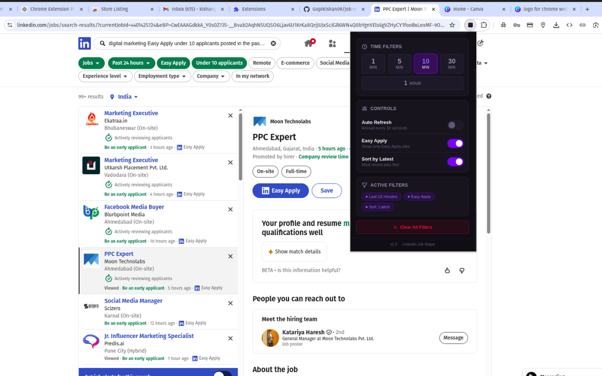

# 🚀 Job Sniper (Chrome Extension)

Enhance your LinkedIn job search with smart automation tools.

## ✨ Features

* 🔄 Auto-refresh job listings
* ⚡ Discover newly posted jobs faster
* 🎯 Lightweight and easy to use
* 🧠 Built for job seekers who want speed

---

## 🛠️ How It Works

1. Open LinkedIn Jobs page
2. Enable auto-refresh from extension popup
3. Page refreshes automatically to show latest jobs

---

## 📸 Screenshots

---

## 🔐 Permissions Used

* **tabs** → refresh active LinkedIn tab
* **storage** → save user preferences
* **alarms** → schedule auto-refresh
* **notifications** → notify user on refresh

---

## ❗ Disclaimer

This extension is not affiliated with LinkedIn.
It is an independent tool to enhance user experience.

---

## 📦 Installation

1. Download repo
2. Go to `chrome://extensions`
3. Enable Developer Mode
4. Load unpacked → select `extension/` folder

---

## 📄 License

MIT License
