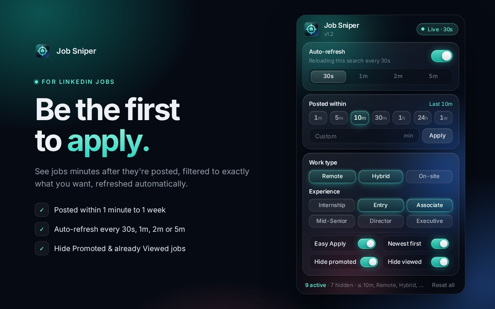
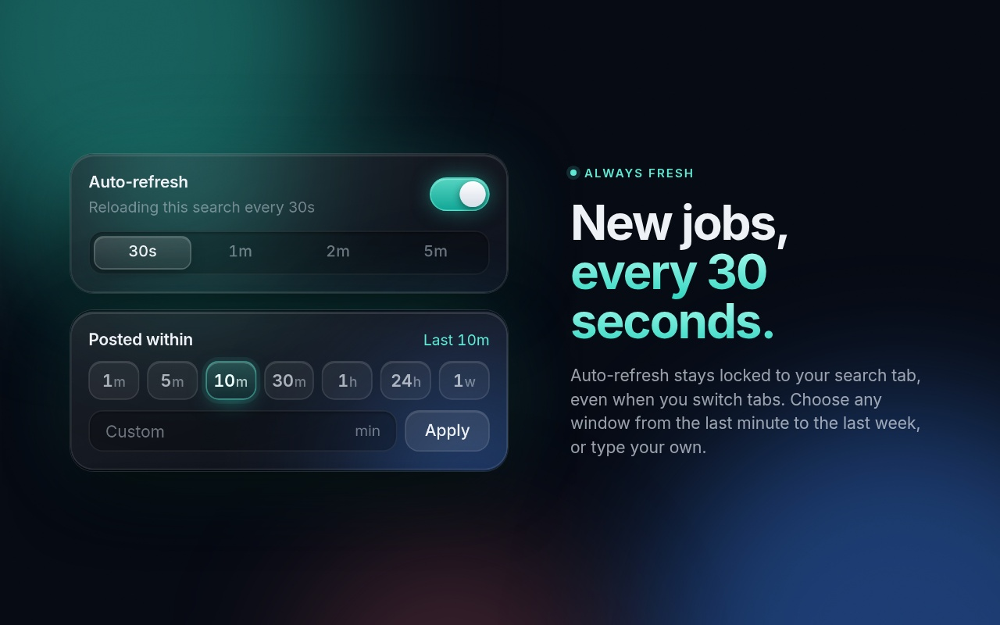
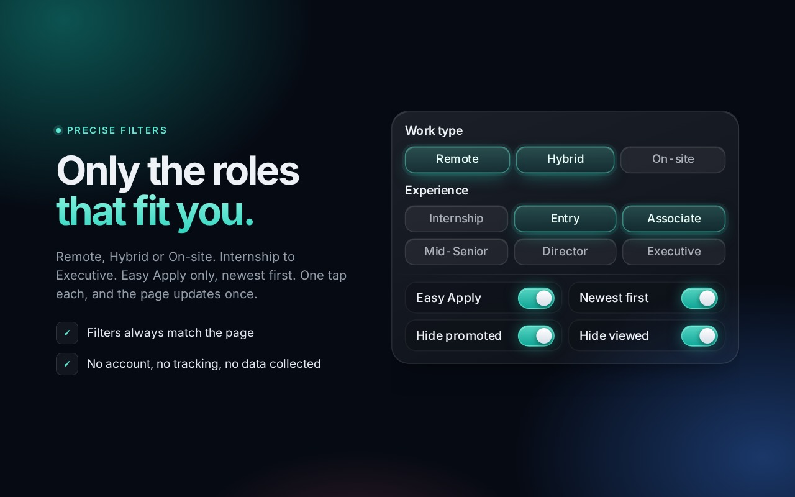
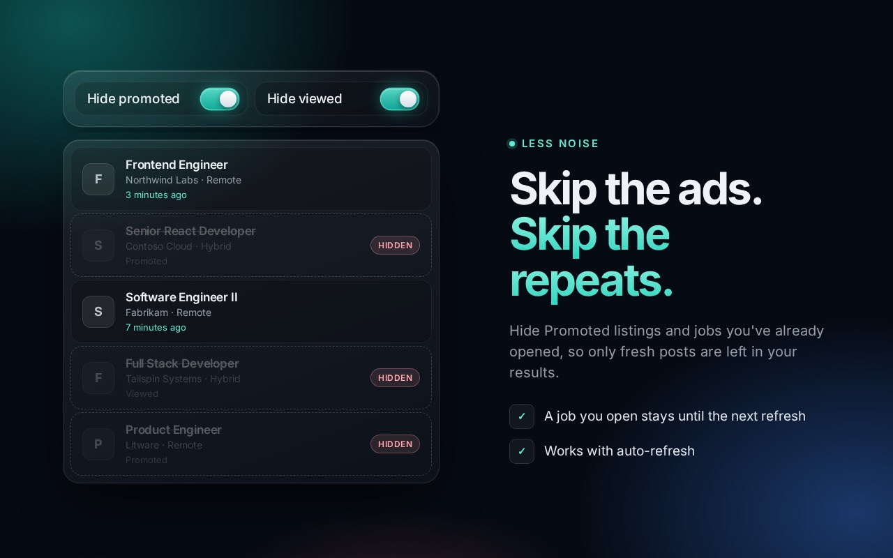

<p align="center">
  
</p>

<h1 align="center">Job Sniper</h1>

<p align="center">
  A small Chrome extension for LinkedIn Jobs. Filter by how recently a job was posted (down to the last minute) and let the page refresh itself.
</p>

<p align="center">
  <a href="https://chromewebstore.google.com/detail/ncjjafmodgfhmbpalmoancigcfbbldef">Chrome Web Store</a> ·
  <a href="support.md">Support</a> ·
  <a href="privacy-policy.md">Privacy</a>
</p>



## Why I made this

When you're job hunting, applying early matters. The first few applicants usually get looked at, and by the time a post has 200 applicants it's mostly too late.

LinkedIn's own "Date posted" filter only goes down to the past 24 hours. The URL supports much finer values, though. You just have to edit it by hand every time. I got tired of doing that, so I built this.

## What it does

- **Posted within.** 1, 5, 10 or 30 minutes, 1 hour, 24 hours or 1 week. You can also type any number of minutes.
- **Auto-refresh.** Reloads your search every 30s, 1m, 2m or 5m. It stays on the tab you started it from, so you can keep working in other tabs. If you close that tab, it stops.
- **Work type.** Remote, Hybrid, On-site.
- **Experience.** Internship through Executive.
- **Easy Apply only**, and **newest first**.
- **Hide Promoted & Viewed jobs.** Removes sponsored listings and jobs you've already opened from the results list. A job you open during the current search stays visible until the next reload, so the list doesn't jump around under you.

The popup reads your filters straight from the page URL, so it always shows what's actually applied. If you click several filters quickly, the page only reloads once.







## Install

The easy way is the [Chrome Web Store](https://chromewebstore.google.com/detail/ncjjafmodgfhmbpalmoancigcfbbldef).

To run it from source:

```bash
git clone https://github.com/gopikishan09/job-sniper-extension.git
```

1. Go to `chrome://extensions` and turn on **Developer mode**.
2. Click **Load unpacked** and pick the `extension` folder.

You need Chrome 120 or newer, because the 30-second refresh depends on it.

## Permissions

| Permission | Why |
|---|---|
| `tabs` | To read and update the LinkedIn Jobs tab's URL, and to reload that tab |
| `storage` | To remember whether auto-refresh is on, at what interval, and your hide settings |
| `alarms` | To run the refresh timer |
| `notifications` | To let you know when auto-refresh stops because the tab was closed |
| `linkedin.com` | It only runs on LinkedIn Jobs pages, where it hides Promoted/Viewed cards if you turn that on |

No data is collected or sent anywhere. There's no backend.

## Project layout

```
extension/
  manifest.json
  popup.html / popup.css / popup.js   the popup UI
  background.js                       auto-refresh timer
  content.js                          hides Promoted / Viewed job cards
  icons/                              icons (icon.svg is the source)
  fonts/                              Inter, bundled locally
store-assets/                         Web Store screenshots and promo tiles
  render.js                           regenerates the screenshots from the real popup
```

## Heads up

This isn't affiliated with LinkedIn. It only changes the search URL, the same way you'd do by hand, and hides cards on the page if you ask it to. Keep the refresh interval reasonable. Hammering the page every 30 seconds all day isn't a great idea.

## License

MIT
