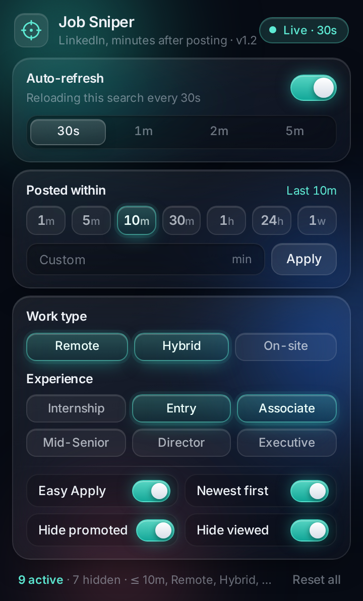

# 🚀 Job Sniper (Chrome Extension)

Enhance your LinkedIn job search with smart automation tools.

## ✨ Features

* ⏱️ **Posted within**: 1m, 5m, 10m, 30m, 1h, 24h, 1w, or any custom number of minutes
* 🔄 **Auto-refresh** at 30s, 1m, 2m or 5m. It stays locked to the LinkedIn tab you started it on, even if you switch tabs
* 🏠 **Work type**: Remote, Hybrid, On-site
* 🎓 **Experience**: Internship → Executive
* ⚡ **Easy Apply only** and **Newest first**
* 🧊 A glassmorphism UI. The filters always match the page URL, so what you see is what's applied

---

## 🛠️ How It Works

1. Open a LinkedIn Jobs search
2. Pick your filters in the popup. Rapid changes are batched into a single page load
3. Turn on auto-refresh to keep the results fresh. It stops by itself (with a notification) if you close the tab or leave LinkedIn Jobs

---

## 📸 Screenshots

---

## 🔐 Permissions Used

* **tabs** → read and update the LinkedIn Jobs tab's URL, and reload it
* **storage** → remember the auto-refresh state and interval
* **alarms** → schedule auto-refresh
* **notifications** → tell you when auto-refresh stops because the tab was closed

---

## ❗ Disclaimer

This extension is not affiliated with LinkedIn.
It is an independent tool to enhance user experience.

---

## 📦 Installation

1. Download repo
2. Go to `chrome://extensions`
3. Enable Developer Mode
4. Load unpacked → select `extension/` folder

---

## 📄 License

MIT License
